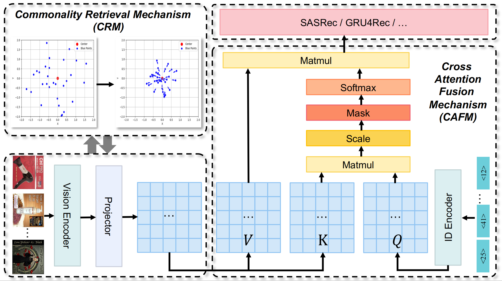

# Introduction
IDEALRec: Refining Recommendation Embeddings through Image-Enhanced Discriminative Alignment and Attentive Fusion


Model architecture:



# Implementation
## Requirements

Python >= 3.7
tqdm == 4.26.0

## Datasets

Four prepared datasets are included in `data` folder.

## Train Model

To train IDEALRec on `Beauty` dataset, change to the `src` folder and run following command: 

```
bash beauty.sh
```
You can train IDEALRec on other datasets in a similar way.

The script will automatically train IDEALRec and save the best model found in validation set, and then evaluate on test set. You are expected to get following results after training:

```
{'Epoch': 0, 'HIT@5': '0.0456', 'NDCG@5': '0.0296', 'HIT@10': '0.0696', 'NDCG@10': '0.0374', 'HIT@20': '0.0998', 'NDCG@20': '0.0449'}
```


## Evaluate Model

You can directly evaluate a trained model on test set by running:

```
python main.py --data_name Beauty --do_eval True
```
